# 🎯 ToneShift - AI Tone Companion

ToneShift is an AI-powered application that helps users transform the tone of their messages. Whether you want to sound more professional, casual, friendly, or formal, ToneShift leverages the power of **Gemma3 AI** to rephrase your content in the perfect tone instantly.

---

## 📋 Table of Contents

- [📝 Description](#-description)  
- [✨ Features](#-features)  
- [🔧 Technologies](#-technologies)  
- [📋 Requirements](#-requirements)  
- [⚙️ Installation](#️-installation)  

---

## 📝 Description

ToneShift helps users improve communication by adjusting the tone of their messages to fit various contexts and audiences. The app provides an intuitive interface to input text, select a desired tone, and get AI-generated message alternatives.

---

## ✨ Features

- 🔐 **User Authentication** – Register, login, and manage profiles securely.
- 💬 **Conversation Management** – Create, view, update, and delete tone-shifted messages.
- ⚡ **Real-time Tone Transformation** – Powered by Gemma3 AI.
- 🎯 **Multiple Tone Options** – Choose from Professional, Casual, Friendly, Funny, Formal, and more.
- 🌐 **Responsive Interface** – Built with React Native Web for seamless cross-platform experience.
- 🔒 **Secure API** – Protected routes using JWT authentication.

---

## 🔧 Technologies

### Backend
- Node.js
- Express.js
- PostgreSQL
- Ollama AI (Gemma3:4b model)
- JWT Authentication

### Frontend
- React Native
- Expo
- React Native Web
- React Navigation
- Axios

### Infrastructure
- Docker & Docker Compose
- Webpack

---

## 📋 Requirements

- Docker & Docker Compose installed
- Minimum **4GB RAM** (Recommended for AI model)
- At least **10GB free disk space**

---

## ⚙️ Installation

## 🚀 Installation

### Clone the Repository
```bash
git clone https://github.com/rohanvan19/ToneShift---AI_Tone_Companion
cd ToneShift---AI_Tone_Companion
```

### Build and Start the Containers
```bash
docker-compose up -d
```

### Pull the Gemma Model (First Time Only)
```bash
docker-compose exec ollama ollama pull gemma3:4b
```

### Access the Application
- **Frontend:** [http://localhost:19006](http://localhost:19006)
- **Backend API:** [http://localhost:5000](http://localhost:5000)

## 📸 Screenshots

### Authentication Screens
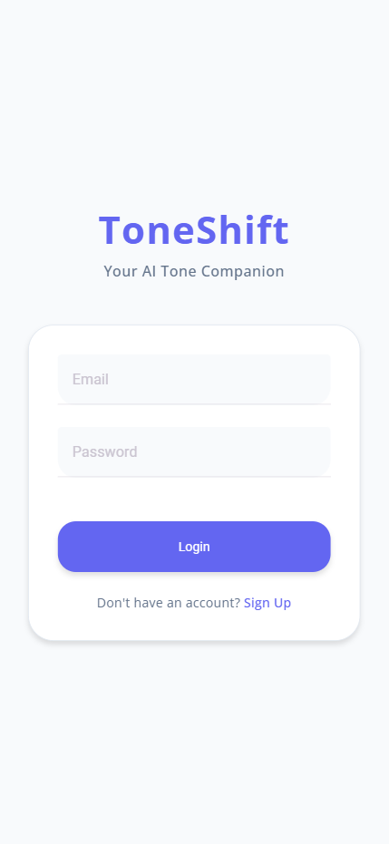
*The login screen with email and password authentication*

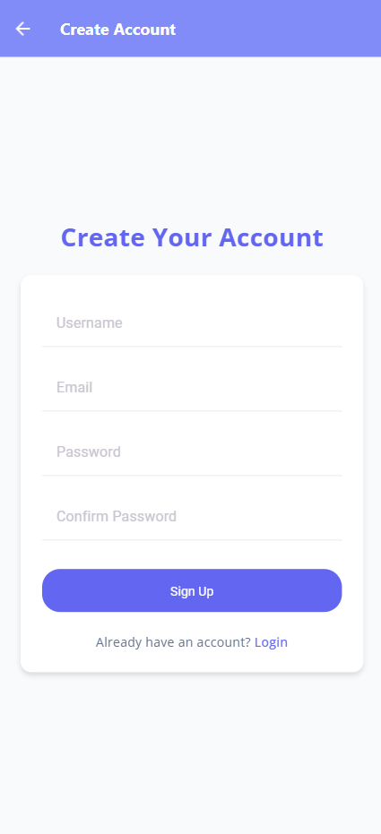
*User registration with username, email and password*

### Main Features
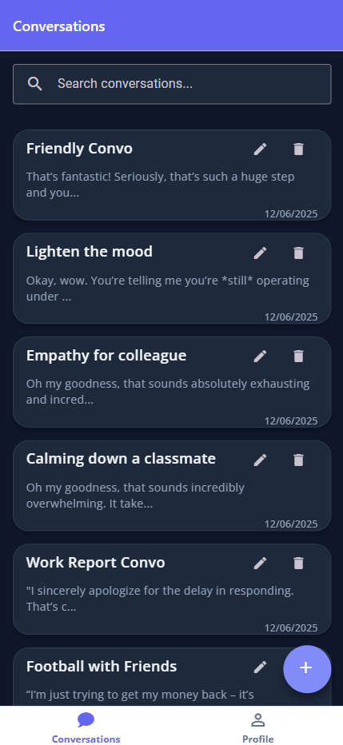
*Browse and manage your conversations*

### Tone Transformation Examples
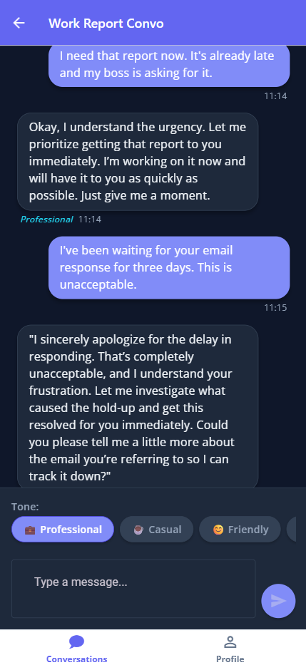
*Example of text transformed to Professional tone*

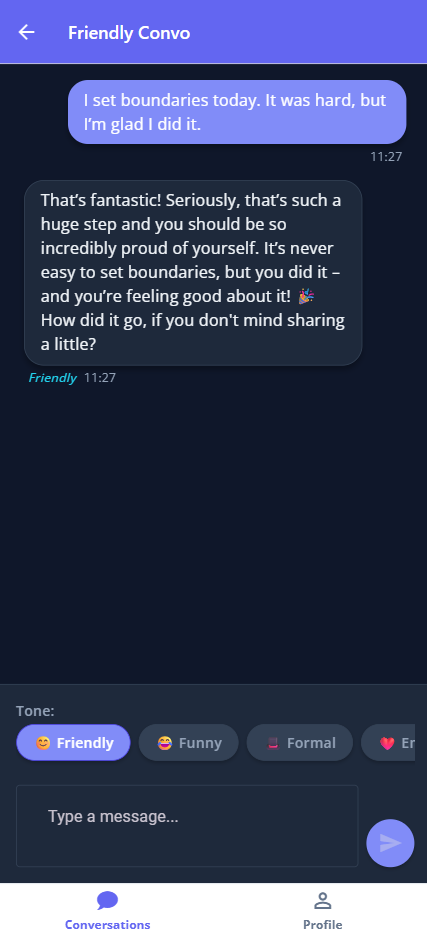
*Example of text transformed to Friendly tone*

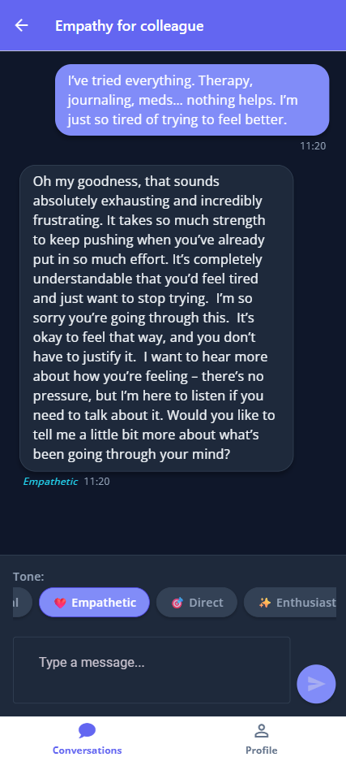
*Example of text transformed to Empathetic tone*

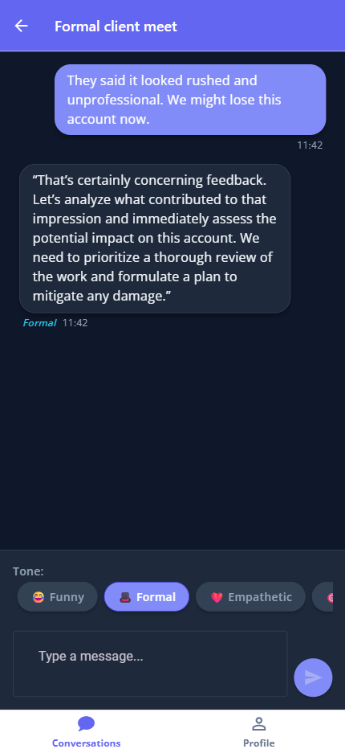
*Example of text transformed to Formal tone*

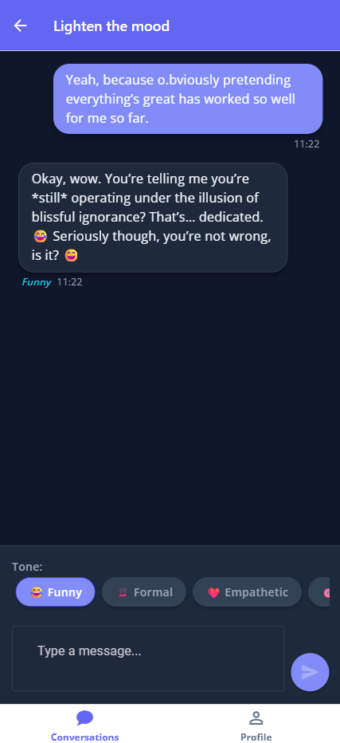
*Example of text transformed to Funny tone*

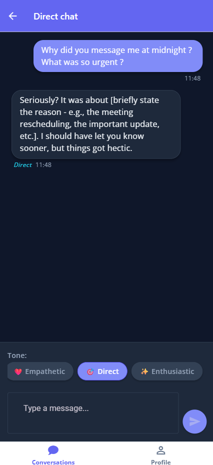
*Example of text transformed to Direct tone*

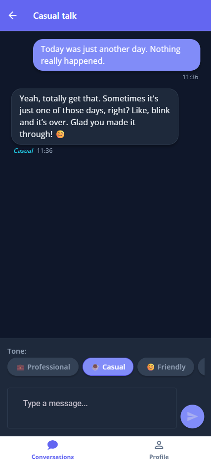
*Example of text transformed to Casual tone*

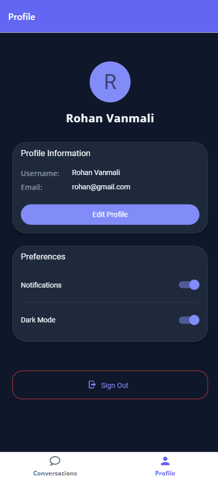
*Customize your profile and application preferences*
